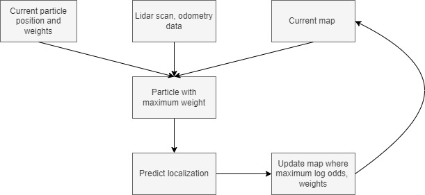

# MonteCarlo_localization_SLAM

This project was done as a part of the course ESE650 : Learning  in Robotics at UPenn. This project involves implementing Simultaneous Localization and Mapping based on Odometry data and 2D-Lidar scans. It uses MonteCarlo sampling and Particle filter to get the localization and generate the occupancy grid of the environment. The pipeline is shown below:

  

# Results

<table>
  <tr>
      <td align = "center">  </td>
      <td align = "center">  </td>
  </tr>
  <tr>
      <td align = "center"> World 0 </td>
      <td align = "center"> World 1 </td>
  </tr>
</table>

<table>
  <tr>
      <td align = "center">  </td>
      <td align = "center">  </td>
  </tr>
  <tr>
      <td align = "center"> World 2 </td>
      <td align = "center"> World 3 </td>
  </tr>
</table>
